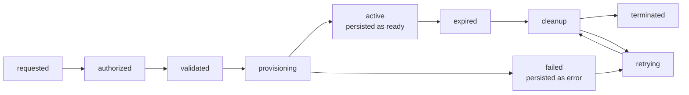
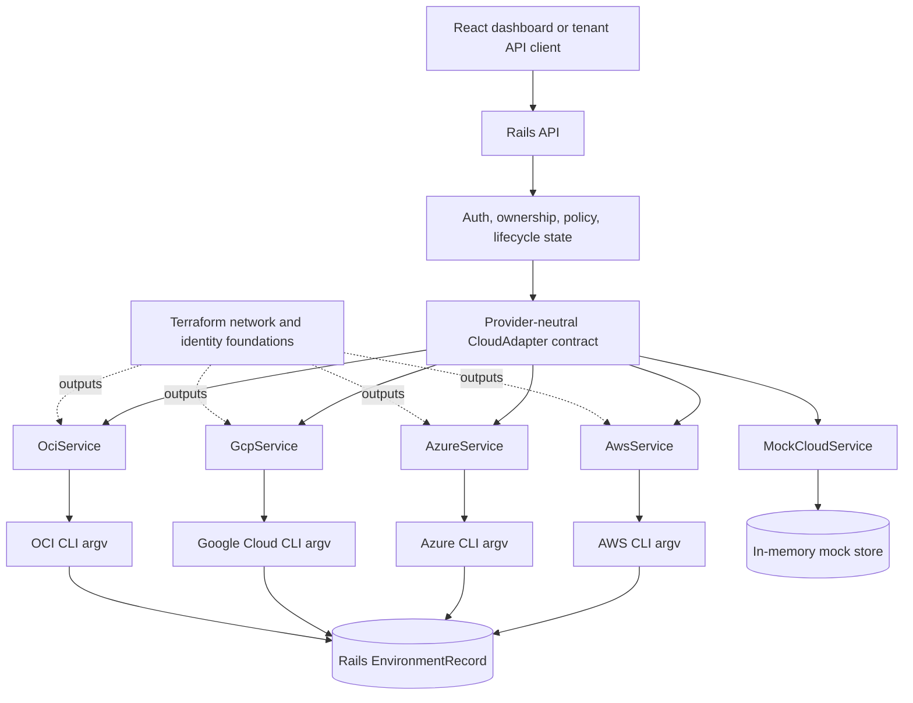
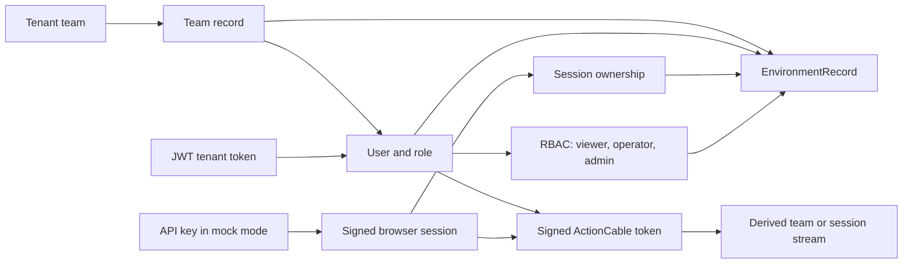

# SEEO

**SEEO, a multi-cloud control-plane prototype for short-lived environments.**

SEEO combines a Rails API, a React dashboard, provider adapters, policy checks, lifecycle state, ActionCable updates, TTL cleanup, and Terraform foundations for AWS, Azure, Google Cloud, and OCI.

The public deployment is a safe mock deployment. It does not create cloud resources or require provider credentials.

## Project links

- [Project overview](https://samueladegnan.github.io/seeo-aws-orchestrator/)
- [Live mock demo](https://seeo-dashboard.vercel.app/)
- [Architecture notes](https://samueladegnan.github.io/seeo-aws-orchestrator/architecture/)
- [Local setup and demo walkthrough](https://samueladegnan.github.io/seeo-aws-orchestrator/demo/)
- [API documentation](https://samueladegnan.github.io/seeo-aws-orchestrator/api/)
- [Security report](https://samueladegnan.github.io/seeo-aws-orchestrator/security/)
- [Source repository](https://github.com/samueladegnan/seeo-aws-orchestrator)

[](https://github.com/samueladegnan/seeo-aws-orchestrator/actions/workflows/ci.yml) [](https://github.com/samueladegnan/seeo-aws-orchestrator/actions/workflows/guardrail.yml)

## What the prototype does

A request enters through the dashboard or Rails API with a provider, region, compute tier, storage tier, TTL, project, and optional idempotency key. Rails authenticates the requester, applies ownership and policy checks, selects an adapter, records normalized lifecycle state, streams authorized updates, estimates cost, and schedules cleanup for expired records.

The shared adapter contract covers create, list, refresh, terminate, expired-resource discovery, and forced termination. Provider-specific CLI construction and response parsing remain inside the AWS, Azure, Google Cloud, and OCI adapters. Mock mode uses the same normalized contract without invoking a cloud CLI.

## Implementation scope

| Capability | Status | Evidence and boundary |
| --- | --- | --- |
| Provider adapter contract | Implemented | `CloudAdapter`, `CliCloudService`, `MockCloudService`, and the provider contract specs cover the shared lifecycle methods. |
| Lifecycle state | Implemented | `Environment` and `EnvironmentRecord` model pending, provisioning, ready, expired, terminating, terminated, and error states. |
| RBAC | Implemented | `User` roles and controller authorization cover admin, operator, and viewer access. |
| Tenant ownership | Implemented | Team-backed records and browser-session records are filtered by ownership context. |
| OPA validation | Implemented with Ruby fallback | `PolicyService` evaluates `policies/provision.rego` when OPA is available and falls back to equivalent Ruby checks. |
| TTL expiry | Implemented | `expires_at`, expired-record queries, and `TtlMonitorJob` provide the expiry path. |
| Cleanup retries | Implemented for records with persisted resource IDs | The recurring job rescans active and error records. A write interruption before a provider ID is stored remains a known recovery gap. |
| Cost estimates | Implemented | `CostTrackingService` applies configured provider, tier, storage, and TTL rates. These are estimates, not billing data. |
| ActionCable updates | Implemented | Signed channel tokens, derived stream keys, team and session authorization, and channel specs are present. |
| Hosted mock mode | Implemented | Render sets `SEEO_MOCK_MODE=true` and the hosted frontend uses a browser-visible mock key. |
| Local mock mode | Implemented | Local defaults use `MockCloudService` for all enabled providers. |
| Terraform foundations | Implemented | Independent AWS, Azure, Google Cloud, and OCI roots expose network and identity-related outputs. They do not deploy the complete runtime. |
| Credentialed AWS provisioning | Not verified | An AWS CLI adapter path exists, but no credentialed integration run is part of this repository or public deployment. |
| Credentialed Azure provisioning | Not verified | An Azure CLI adapter path exists, but no credentialed integration run is part of this repository or public deployment. |
| Credentialed Google Cloud provisioning | Not verified | A Google Cloud CLI adapter path exists, but no credentialed integration run is part of this repository or public deployment. |
| Credentialed OCI provisioning | Not verified | An OCI CLI adapter path exists, but no credentialed integration run is part of this repository or public deployment. |

## Lifecycle

The first three nodes are request pipeline stages rather than persisted status values. `active` maps to the persisted `ready` state and `failed` maps to the persisted `error` state.



## Provider adapter architecture



## Tenant and authorization model



Tenant JWTs identify a persisted user and team. The mock API key creates a transient service identity, then a signed browser session supplies the ownership boundary. A team-backed record is owned by the team. A mock service-account record without a team is owned by its browser session. ActionCable never trusts an arbitrary stream key from the browser. The server derives the authorized team or session stream from the signed token.

## Mock mode

### What it does

- Selects `MockCloudService` through the same `CloudService` and `CloudAdapter` path used by the real adapters
- Supports AWS, Azure, Google Cloud, and OCI provider catalogs, regions, compute shapes, storage shapes, and lifecycle transitions
- Creates synthetic provider resource IDs, instance IDs, volume IDs, and documentation-only IP addresses
- Simulates provisioning with a short in-memory delay before moving a record to `ready`
- Exercises policy checks, idempotency, cost estimates, ownership filtering, ActionCable broadcasts, and termination
- Keeps the hosted demo credential-free from a cloud perspective

### What it does not do

- It does not call AWS, Azure, Google Cloud, or OCI APIs
- It does not authenticate to a cloud account
- It does not create VMs, disks, networks, identities, or billable resources
- It does not persist mock records across process restarts
- It does not prove provider quotas, cloud permissions, network reachability, or provider-side asynchronous behavior
- It does not provide production-scale durability or availability evidence

### Provider resource IDs by execution mode

In mock mode, IDs are synthetic values such as `gcp-vm-<random>` and are stored only in the in-memory process store. The displayed `203.0.113.0/24` and private addresses are illustrative values.

In credentialed mode, the CLI adapter extracts the identifier returned by the provider command and persists it in `EnvironmentRecord.provider_resource_id`. The repository contains command and normalization contract tests with fixtures, but it does not contain a credentialed integration run proving that path against a live cloud account.

## Failure recovery walkthrough

The recoverable path depends on the provider resource ID being persisted.

1. The adapter writes a provisional `provisioning` record before invoking the provider command.
2. The provider creates the resource and returns a provider resource ID.
3. The adapter persists that ID in `EnvironmentRecord.provider_resource_id` and broadcasts the normalized state.
4. A later database write or lifecycle update is interrupted. The record still contains the provider ID and remains in an active or error state.
5. `TtlMonitorJob` discovers the expired or incomplete record during its recurring scan.
6. The cleanup context calls `force_terminate_environment` using the persisted provider ID.
7. The adapter issues the provider-specific terminate command, persists `terminated`, and broadcasts the final state.

If the database write fails before the provider ID is stored, the current implementation cannot reliably identify the external resource. That is a known limitation and the reason credentialed operation is not presented as production-ready. A durable operation journal or provider-side reconciliation worker would close that gap.

## Local setup

### Safe mock demo

```bash
cd backend
cp .env.example .env
docker build -t seeo-backend .
docker run --rm -p 3000:3000 --env-file .env seeo-backend
```

In a second terminal:

```bash
cd frontend
cp .env.example .env
npm ci
npm run dev
```

Open [http://localhost:5173](http://localhost:5173). The default configuration uses mock mode and does not need provider credentials.

### Documentation site

```bash
cd docs
docker compose up --build
```

Open [http://localhost:4000](http://localhost:4000).

## Validation commands

Run these from the repository root unless a different directory is shown.

### Rails tests and lint

```bash
cd backend
bundle exec rspec
bundle exec rubocop
```

### Policy tests

The Ruby policy specs cover valid requests, TTL limits, provider-specific regions, and compute tiers.

```bash
cd backend
bundle exec rspec spec/services/policy_service_spec.rb
```

If OPA is installed, evaluate the policy document directly with a representative input:

```bash
opa eval -d policies/provision.rego -I 'data.seeo.allow' -i <(printf '%s' '{"provider":"gcp","compute_tier":"small","ttl_minutes":60,"region":"us-central1","volume_size":10,"storage_tier":"balanced","active_environment_count":0}')
```

### Adapter tests

```bash
cd backend
bundle exec rspec spec/services/provider_adapter_contract_spec.rb
bundle exec rspec spec/services/mock_cloud_service_spec.rb spec/services/cli_cloud_service_spec.rb
```

These tests stub subprocesses and use checked-in response fixtures. They do not contact a cloud provider.

### Frontend checks

```bash
cd frontend
npm ci
npm audit --omit=optional
npm run lint
npm run build
```

### Terraform validation

```bash
for stack in infrastructure infrastructure/stacks/azure infrastructure/stacks/gcp infrastructure/stacks/oci; do
  terraform -chdir="$stack" fmt -check -recursive
  terraform -chdir="$stack" init -input=false
  terraform -chdir="$stack" validate
 done
```

### Security scans

```bash
gem install brakeman --no-document
brakeman --format sarif --no-exit-on-warn --output seeo-brakeman.sarif backend
```

The Guardrail workflow builds the pinned Guardrail image and triages the Brakeman SARIF. Its exact implementation is in `.github/workflows/guardrail.yml`.

### Docker checks

```bash
docker build -t seeo-backend backend
docker build --file backend/Dockerfile.runner --tag seeo-provider-runner:ci backend
docker build -t seeo-docs-check docs
```

The runner image contains provider CLIs but no credentials. The public backend image runs in mock mode by configuration.

### CI

GitHub Actions runs backend RuboCop and RSpec, fixture parsing, the provider runner build, frontend audit and build checks, Terraform validation, Checkov, and the Guardrail workflow. The workflow files are the source of truth because CI runs on GitHub rather than as one local command.

## Known limitations

- Credentialed provider execution has not been run against disposable cloud accounts in this repository
- Terraform roots provide network and identity foundations, not a complete production deployment
- Mock records are process-local and do not demonstrate durable distributed state
- The cleanup path cannot recover a provider resource if the database fails before its provider ID is persisted
- Cleanup retries occur through recurring scans rather than a dedicated durable retry queue
- Cost values are estimates and are not provider billing data
- ActionCable uses the configured Rails adapter and does not establish multi-instance WebSocket scale
- No load, performance, availability, disaster recovery, or uptime evidence is claimed
- The public demo API key is intentionally browser-visible and valid only for mock mode
- No independent security assessment is claimed

## Technology

| Layer | Technology |
| --- | --- |
| API and business logic | Ruby 3.3, Ruby on Rails 7.2, Active Model, Active Record |
| Frontend | React 18, Vite, Tailwind CSS, ESLint |
| Real-time | ActionCable and WebSockets |
| Provider boundary | AWS, Azure, Google Cloud, OCI CLI adapters plus a mock adapter |
| State | Rails control-plane records with SQLite for local development |
| Policy | OPA/Rego with a Ruby fallback |
| Infrastructure | Terraform roots for AWS, Azure, Google Cloud, and OCI |
| Quality | RSpec, RuboCop, Brakeman, Checkov, npm audit, and GitHub Actions |

## AI-assisted development note

I used AI tools during parts of the build. I remain responsible for the architecture, implementation, tests, security model, documentation, and final review.

## License

MIT (c) 2026 [Samuel Degnan](https://github.com/samueladegnan)
