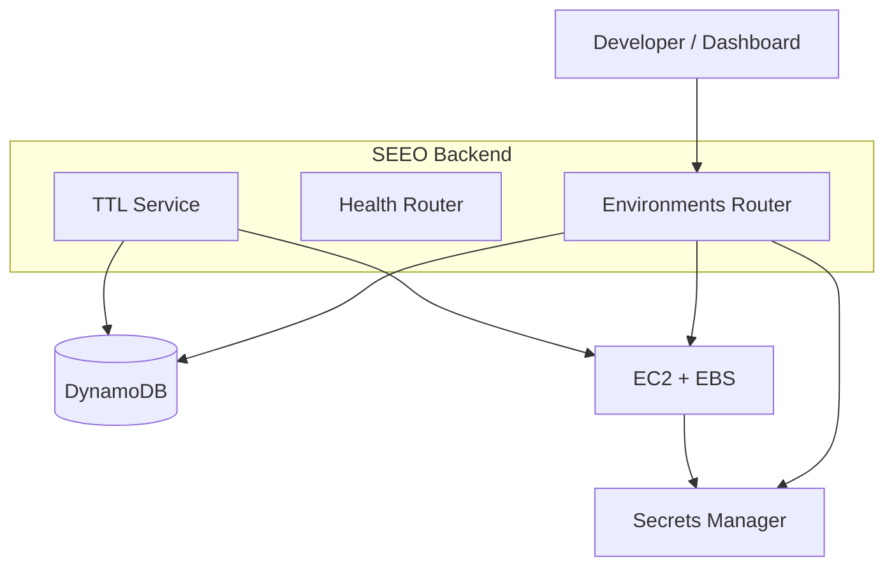

# SEEO Architecture

## High-level flow

1. A developer requests an environment through the **FastAPI backend** or the web dashboard.
2. The backend persists environment metadata in **DynamoDB**.
3. The backend launches a **hardened EC2 instance** with an attached **EBS volume**.
4. The instance uses an **IAM role** to fetch runtime credentials from **AWS Secrets Manager**.
5. A background **TTL service** monitors DynamoDB and tears down expired environments automatically.

## Component diagram

## Security highlights

- **No hardcoded secrets** in source code or user-data.
- **IAM least privilege** — EC2 instance role can only read its assigned secret.
- **API key authentication** on all sensitive endpoints.
- **Non-root container** in the provided Dockerfile.
- **Encrypted secrets at rest** via AWS Secrets Manager and DynamoDB.

## Infrastructure

The `infrastructure/` directory contains Terraform code for:

- VPC, public subnets, and internet gateway
- Security group with conditional SSH
- IAM role and instance profile for EC2
- DynamoDB environments table
- Secrets Manager secret
- Optional IAM user for the backend runner
