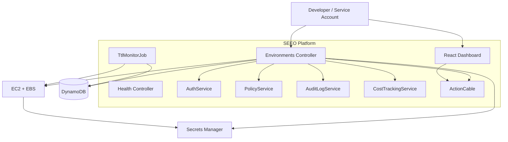

# SEEO Architecture

## High-level flow

1. A developer or service account requests an environment through the **React dashboard** or the **Rails API**.
2. The backend authenticates the request via a **JWT tenant token** or **API key** and resolves the user's team and role.
3. The **policy engine** validates the request against TTL, instance type, and team limits. If OPA is installed, it runs the Rego policy; otherwise, the built-in Ruby fallback enforces the same rules.
4. The backend persists environment metadata in **DynamoDB** and writes an audit record.
5. The backend launches a **hardened EC2 instance** with an attached **EBS volume**.
6. The instance uses an **IAM role** to fetch runtime credentials from **AWS Secrets Manager**.
7. A background **TTL service** monitors environments and tears down expired ones automatically.
8. **ActionCable** broadcasts state changes to connected dashboard clients.

## Component diagram

## Built-in security controls

- **Authentication**: every sensitive endpoint requires a JWT tenant token or API key.
- **RBAC**: admin, operator, and viewer roles restrict what each user can do.
- **Policy-as-code**: OPA/Rego enforces TTLs, allowed instance types, and team limits before provisioning, with a built-in Ruby fallback.
- **Audit logging**: every create/destroy event is recorded with actor, team, and timestamp.
- **No hardcoded secrets**: runtime credentials are fetched from AWS Secrets Manager.
- **IAM least privilege**: the EC2 instance role can only read its assigned secret.
- **Encrypted data at rest**: DynamoDB and Secrets Manager encrypt data.
- **Non-root container**: the backend Dockerfile runs as an unprivileged user.

## Infrastructure

The `infrastructure/` directory contains Terraform code for:

- VPC, public subnets, and internet gateway
- Security group with conditional SSH
- IAM role and instance profile for EC2
- DynamoDB environments, audit log, and cost snapshot tables
- Secrets Manager secret
- Optional IAM user for the backend runner
- CloudWatch log group and ECR repository
