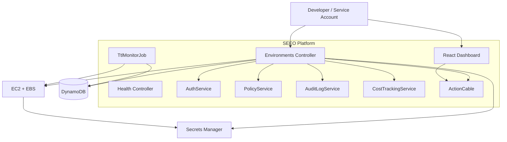

# SEEO Architecture

## High-level flow

1. A developer or service account requests an environment through the **React dashboard** or the **Rails API**.
2. The backend authenticates the request via **JWT tenant token** or **API key** and resolves the user's team and role.
3. **Policy-as-code** (OPA/Rego) validates the request against TTL, instance type, and team limits.
4. The backend persists environment metadata in **DynamoDB** and writes an audit record.
5. The backend launches a **hardened EC2 instance** with an attached **EBS volume**.
6. The instance uses an **IAM role** to fetch runtime credentials from **AWS Secrets Manager**.
7. A background **TTL service** monitors DynamoDB and tears down expired environments automatically.
8. **ActionCable** broadcasts state changes to connected dashboards clients.

## Component diagram

## Security highlights

- **No hardcoded secrets** in source code or user-data.
- **IAM least privilege** — EC2 instance role can only read its assigned secret.
- **JWT + API key authentication** on all sensitive endpoints.
- **RBAC** — admin, operator, and viewer roles limit what each user can do.
- **Policy-as-code** — OPA/Rego enforces guardrails before any AWS call.
- **Audit logging** — every create/destroy event is recorded with actor, team, and timestamp.
- **Non-root container** in the provided Dockerfile.
- **Encrypted secrets at rest** via AWS Secrets Manager and DynamoDB.

## Infrastructure

The `infrastructure/` directory contains Terraform code for:

- VPC, public subnets, and internet gateway
- Security group with conditional SSH
- IAM role and instance profile for EC2
- DynamoDB environments and audit log tables
- Secrets Manager secret
- Optional IAM user for the backend runner
