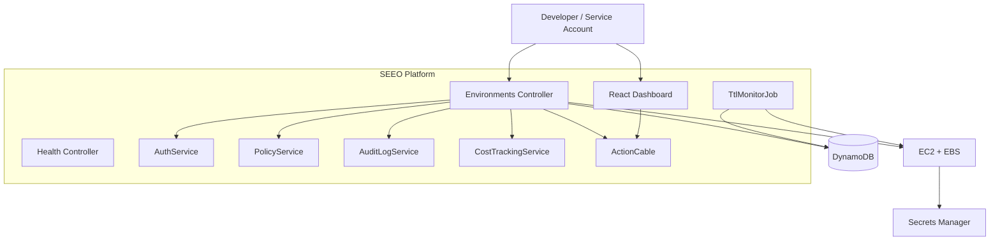

# SEEO Architecture

The flow below describes the real AWS provider path. The deployed portfolio demo uses the in-memory mock provider, so it does not create EC2, EBS, DynamoDB, or Secrets Manager resources.

## High-level flow

1. A developer or service account requests an environment through the **React dashboard** or the **Rails API**.
2. The backend authenticates the request via a **JWT tenant token** or scoped **API key**, resolves the user's team and role, and records ownership on the environment.
3. The **policy engine** validates the request against TTL, instance type, and team limits. If OPA is installed, it runs the Rego policy. If OPA is unavailable, the built-in Ruby fallback enforces the same rules.
4. The backend reserves environment metadata in **DynamoDB** and starts the provider lifecycle.
5. The backend launches an **EC2 instance** and attaches an **EBS volume**. Partial resource IDs are persisted so cleanup can be retried if a later provider call fails.
6. The instance uses an **IAM role** to fetch runtime credentials from **AWS Secrets Manager**.
7. The controller records the create event after the provider call returns. A background **TTL service** monitors environments and tears down expired ones automatically.
8. The backend issues a short-lived signed **ActionCable** token. The channel derives a team or browser-session stream from that token and broadcasts state changes only to that stream.

## Component diagram

## Built-in security controls

- **Authentication**: sensitive endpoints require a JWT tenant token or an API key in local/mock mode. Real AWS lifecycle actions require JWT tenant authentication. WebSockets require a separate short-lived signed token.
- **RBAC**: admin, operator, and viewer roles restrict what each user can do.
- **Policy-as-code**: OPA/Rego enforces TTLs, allowed instance types, and team limits before provisioning, with a built-in Ruby fallback.
- **Tenant ownership**: environment records persist team, user, and demo-session ownership fields. Reads and user lifecycle actions enforce that ownership.
- **Audit logging**: every create/destroy event is recorded with actor, team, and timestamp.
- **No committed secrets**: runtime credentials are fetched from AWS Secrets Manager. Deployment secrets are injected through the environment, while local templates use clearly local-only values.
- **IAM least privilege**: the EC2 instance role can only read the configured runtime secret. The backend persists partial resource IDs, cleans up independently, and records failed cleanup for retry.
- **Encrypted data at rest**: DynamoDB and Secrets Manager encrypt data.
- **Non-root container**: the backend Dockerfile runs as an unprivileged user.

## Infrastructure

The `infrastructure/` directory contains Terraform code for:

- VPC, public subnets, and internet gateway
- Security group with conditional SSH
- IAM role and instance profile for EC2
- DynamoDB environments, audit log, and cost snapshot tables
- Secrets Manager secret
- Optional IAM user for the backend runner
- CloudWatch log group and ECR repository
