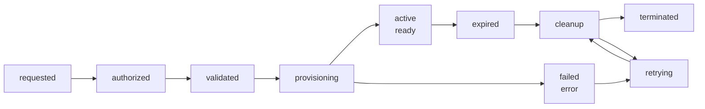
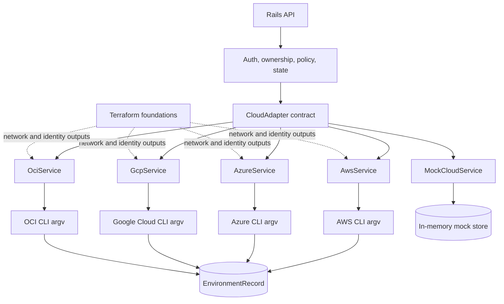
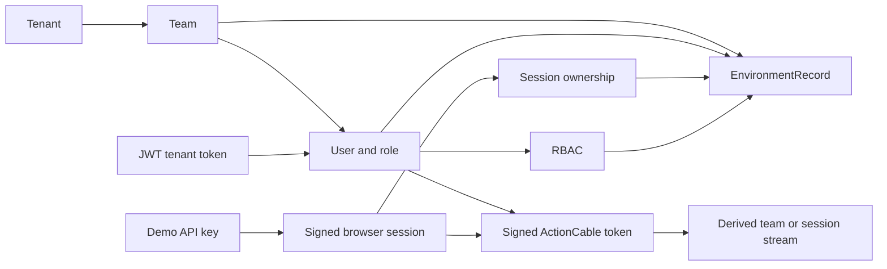

# SEEO Architecture

SEEO gives AWS, Azure, Google Cloud, and OCI one lifecycle contract. Rails owns authentication, authorization, policy, environment state, audit events, cost estimates, live updates, and TTL cleanup. Provider adapters own the cloud-specific resource calls.

## High-level flow

1. The React dashboard or Rails API receives a request with a provider, region, compute tier, storage tier, TTL, and project.
2. Rails authenticates the requester, resolves the team and role, and establishes the ownership context.
3. Policy validates the provider allow-list, provider-specific region, resource tiers, TTL, storage size, and team capacity.
4. `CloudAdapter.for` selects the adapter for AWS, Azure, Google Cloud, OCI, or mock mode.
5. The adapter creates the provider resources and writes normalized identifiers to the Rails control-plane database after each successful operation.
6. ActionCable broadcasts state changes to the authorized team or browser-session stream.
7. `TtlMonitorJob` scans every enabled provider and invokes the same cleanup contract for expired records.
8. Terraform roots provide the provider network and identity foundations consumed by the matching adapter.

## Lifecycle state and request pipeline

The lifecycle diagram distinguishes request pipeline stages from persisted records. `active` maps to `ready` in the Rails model and `failed` maps to `error`.

## Provider adapter architecture

## Tenant and authorization model

## Component diagram

The diagram below follows the request from the browser to the provider boundary. Each lane is intentionally readable on its own: on smaller screens the lanes stack instead of shrinking a large SVG until its labels become unreadable.

<section class="architecture-diagram" aria-labelledby="architecture-diagram-title">
  

    

      Request path
      <h3 id="architecture-diagram-title">One control plane, four provider boundaries</h3>
    

    
Solid arrows show lifecycle flow. Dashed links represent Terraform outputs supplied to the matching adapter.

  

  

    
1. Request

    

      
<strong>Developer or service account</strong>Chooses provider, region, tier, storage, and TTL

      →
      
<strong>React dashboard</strong>Creates and observes environments

      →
      
<strong>Rails API</strong>Single lifecycle entry point

    

  

  

    
2. Control plane

    

      
<strong>Auth &amp; ownership</strong>JWT, demo sessions, RBAC, tenant scope

      
<strong>Policy gate</strong>Provider, region, TTL, tiers, storage, capacity

      
<strong>Adapter factory</strong><code>CloudAdapter.for</code> selects the boundary

      
<strong>Rails state</strong>Lifecycle, IDs, audit events, cost estimates

      
<strong>Live updates &amp; cleanup</strong>ActionCable streams and <code>TtlMonitorJob</code>

    

  

  

    
3. Provider boundary

    

      
<strong>AWS</strong>VM and storage

      
<strong>Azure</strong>VM and disk

      
<strong>Google Cloud</strong>GCE VM and persistent disk

      
<strong>OCI</strong>Compute and block volume

      
<strong>Mock adapter</strong>Safe browser-visible demo path

    

  

  

    
4. Terraform inputs

    

      
<strong>Independent provider roots</strong>AWS · Azure · Google Cloud · OCI

      ⇢
      
<strong>Network &amp; identity outputs</strong>Consumed by the matching runtime adapter

    

  

</section>

Accessible text version

A developer or service account sends a provider, region, tier, storage, and TTL to the React dashboard or Rails API. Rails authenticates the requester, applies ownership and policy checks, then selects one provider adapter. The adapter creates or removes provider resources and writes normalized lifecycle state to Rails. ActionCable sends authorized updates to the owning team or browser session. Terraform roots provide network and identity outputs to the matching adapter.

<pre><code>Developer or service account
        |
        v
React dashboard or Rails API
        |
        v
Auth, ownership, policy, adapter factory, Rails state
        |
        +--> AWS
        +--> Azure
        +--> Google Cloud
        +--> OCI
        +--> Mock adapter
        ^
        |
Terraform network and identity outputs</code></pre>

## Provider contract

The controller does not call EC2, Azure Compute, Compute Engine, or OCI directly. It calls the shared lifecycle methods:

- `create_environment(project, ttl_minutes, compute_tier, options)`
- `list_environments(status_filter)`
- `refresh_environment_state(environment_id)`
- `terminate_environment(environment_id)`
- `list_expired_environments`
- `force_terminate_environment(environment_id)`

Every adapter returns the same `Environment` shape. Provider-specific details remain in `provider_resource_id`, `provider_resource_type`, `instance_type`, and `volume_type` for operational visibility, while `provider`, `compute_tier`, `storage_tier`, `region`, and `ttl_minutes` remain normalized.

## Control-plane state

Rails stores environment lifecycle state in its own database. This keeps tenant ownership, idempotency, auditability, and TTL recovery independent from any provider's data store. Terraform state remains provider-specific and is never used as the request-time environment database.

This separation is deliberate: a provider outage must not erase the control plane's knowledge of what should be cleaned up. The trade-off is that cleanup must tolerate partial operations, stale provider IDs, and asynchronous provider failures.

## Why the adapters stay separate

The lifecycle is normalized, not the cloud APIs. Each adapter owns its provider's networking, identity, resource shapes, CLI commands, and response parsing. That keeps controllers, policy, persistence, and the dashboard provider-neutral. The cost is some intentional duplication between adapters rather than leaking four clouds into every layer.

The real adapters currently use CLI boundaries because argv construction and JSON normalization are easy to inspect with checked-in fixtures and subprocess contract tests. A credential-free runner image packages the four CLIs, while direct SDK workers remain a future option if richer typed APIs or higher execution volume justify the added coupling.

## Infrastructure

Each Terraform root can be initialized and validated without unrelated provider credentials. Real adapter runners additionally need the selected cloud CLI, image settings, short-lived workload identity, and provider integration tests:

- AWS: VPC, subnets, security group, IAM, state-supporting services, logs, and registry
- Azure: resource group, virtual network, and subnet
- Google Cloud: VPC network and subnetwork
- OCI: VCN and subnet

The roots export network identifiers for the matching runtime adapter. AWS, Azure, Google Cloud, and OCI runners normalize their native CLI responses before writing control-plane state. `backend/Dockerfile.runner` packages the four CLIs without credentials. Authentication is supplied at runtime through workload identity or standard environment configuration and is never committed.

## Expiry and recovery

Every environment has an expiry time. `TtlMonitorJob` scans enabled providers and retries cleanup using the persisted provider IDs, making temporary infrastructure harder to forget than to delete. Cleanup is asynchronous by design and must tolerate provider failures.

## Built-in security controls

- JWT tenant authentication and signed mock browser sessions
- RBAC for viewer, operator, and administrator roles
- Provider-aware OPA/Rego policy with a Ruby fallback
- Team and browser-session ownership filtering
- Signed ActionCable tokens with server-derived stream authorization
- Audit events in the shared Rails control plane
- Explicit provider resource IDs for partial cleanup and retry
- No committed provider credentials, Terraform secret values, or browser-authorized real cloud credentials
